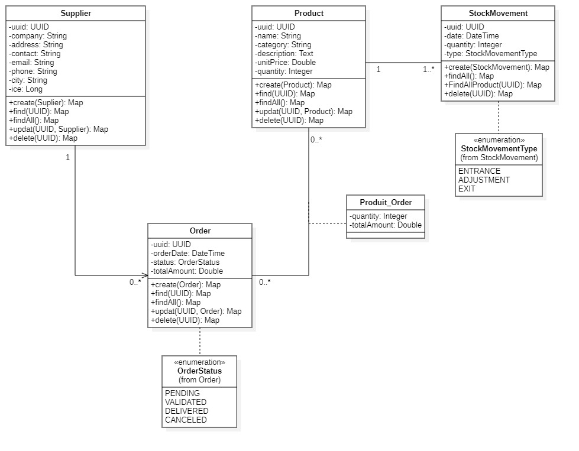

# 📦 Gestion des Approvisionnements - Tricol

[](https://www.oracle.com/java/)
[](https://spring.io/projects/spring-boot)
[](https://spring.io/projects/spring-data-jpa)
[](https://mapstruct.org/)
[](https://www.liquibase.org/)
[](https://swagger.io/)
[](https://www.postgresql.org/)

## 📋 Description du Projet

**Tricol** est une entreprise spécialisée dans la conception et la fabrication de vêtements professionnels. Ce projet constitue le module de **gestion des commandes fournisseurs**, une étape clé dans la digitalisation complète des processus d'approvisionnement et de production.

L'application offre une API REST complète permettant de gérer l'ensemble du cycle de vie des commandes fournisseurs, depuis leur création jusqu'à leur livraison, avec un suivi rigoureux des mouvements de stock et de la valorisation des coûts.

## 🎯 Objectifs

- Gérer les fournisseurs (création, modification, suppression, consultation)
- Gérer les produits et leur catalogue
- Créer et suivre les commandes fournisseurs
- Automatiser les mouvements de stock lors des livraisons
- Calculer automatiquement les coûts selon les méthodes FIFO
- Assurer une traçabilité complète des approvisionnements

## 🚀 Fonctionnalités Principales

### 1. Gestion des Fournisseurs
- ✅ CRUD complet (Create, Read, Update, Delete)
- ✅ Recherche par email ou code ICE
- ✅ Filtrage par ville, société ou contact
- ✅ Pagination des résultats

**Informations stockées** : société, adresse, contact, email, téléphone, ville, ICE

### 2. Gestion des Produits
- ✅ CRUD complet des produits
- ✅ Suivi du stock actuel
- ✅ Filtrage par nom ou catégorie
- ✅ Pagination des résultats
- ✅ Consultation de l'historique des mouvements de stock

**Informations stockées** : nom, description, prix unitaire, catégorie, stock actuel

### 3. Gestion des Commandes Fournisseurs
- ✅ Création de commandes multi-produits
- ✅ Association automatique fournisseur-produits
- ✅ Calcul automatique du montant total
- ✅ Gestion des statuts : `EN_ATTENTE`, `VALIDÉE`, `LIVRÉE`, `ANNULÉE`
- ✅ Modification et annulation de commandes
- ✅ Filtrage par statut, fournisseur ou produit
- ✅ Consultation des commandes par fournisseur

### 4. Gestion des Mouvements et Valorisation du Stock

#### Mouvements de Stock Automatiques
- 📥 Création automatique de mouvements `ENTREE` lors de la livraison
- 📤 Support des mouvements de type `SORTIE` et `AJUSTEMENT`
- 🔄 Mise à jour automatique du stock disponible
- 📊 Historique complet des mouvements par produit

#### Méthodes de Valorisation
Le système supporte deux méthodes de calcul du coût :

**FIFO (First In, First Out)**
- Les premières entrées en stock sont considérées comme les premières sorties
- Coût basé sur les prix d'achat chronologiques

**CUMP (Coût Unitaire Moyen Pondéré)**
- Calcul du coût moyen après chaque entrée
- Formule : `CUMP = (Stock ancien × CUMP ancien + Quantité entrée × Prix unitaire) / (Stock ancien + Quantité entrée)`
- **Méthode par défaut** configurable dans l'application

#### Calcul du Montant Total
```
Montant Total = Σ (Prix Unitaire Produit × Quantité Commandée)
```

## Conception :
- Diagramme de classe :
    ;

## 🛠️ Technologies Utilisées

| Technologie | Version | Usage |
|------------|---------|-------|
| **Spring Boot** | 3.x | Framework principal |
| **Spring Data JPA** | - | Accès aux données |
| **MapStruct** | - | Mapping Entity ↔ DTO |
| **Liquibase** | - | Gestion des migrations de base de données |
| **Swagger/OpenAPI** | 3.x | Documentation API automatique |
| **Jakarta Validation** | - | Validation des données |
| **PostgreSQL/MySQL** | - | Base de données relationnelle |

## 📊 Modèle de Données

### Entité `Fournisseur`
```
- id (UUID)
- societe (String)
- adresse (String)
- contact (String)
- email (String, unique)
- telephone (String)
- ville (String)
- ICE (String, unique)
```

### Entité `Produit`
```
- id (UUID)
- nom (String)
- description (String)
- prixUnitaire (BigDecimal)
- categorie (String)
- stockActuel (Integer)
```

### Entité `CommandeFournisseur`
```
- id (UUID)
- dateCommande (LocalDateTime)
- statut (Enum: EN_ATTENTE, VALIDÉE, LIVRÉE, ANNULÉE)
- montantTotal (BigDecimal)
- fournisseur (ManyToOne)
- produits (ManyToMany)
```

### Entité `MouvementStock`
```
- id (UUID)
- date (LocalDateTime)
- quantite (Integer)
- type (Enum: ENTREE, SORTIE, AJUSTEMENT)
- produit (ManyToOne)
- commandeFournisseur (ManyToOne, nullable)
```

## 🔌 Endpoints API

### Fournisseurs (`/api/v1/suppliers`)
| Méthode | Endpoint | Description |
|---------|----------|-------------|
| GET | `/` | Liste paginée des fournisseurs (filtres: ville, société, contact) |
| POST | `/` | Créer un nouveau fournisseur |
| GET | `/{uuid}` | Récupérer un fournisseur par UUID |
| PUT | `/{uuid}` | Mettre à jour un fournisseur |
| DELETE | `/{uuid}` | Supprimer un fournisseur |
| GET | `/email/{email}` | Rechercher par email |
| GET | `/ice/{ice}` | Rechercher par code ICE |

### Produits (`/api/vi/products`)
| Méthode | Endpoint | Description |
|---------|----------|-------------|
| GET | `/` | Liste paginée des produits (filtres: nom, catégorie) |
| POST | `/` | Créer un nouveau produit |
| GET | `/{uuid}` | Récupérer un produit par UUID |
| PUT | `/{uuid}` | Mettre à jour un produit |
| DELETE | `/{uuid}` | Supprimer un produit |
| GET | `/{productId}/stockMovements` | Historique des mouvements de stock |

### Commandes (`/api/vi/orders`)
| Méthode | Endpoint | Description |
|---------|----------|-------------|
| GET | `/` | Liste paginée des commandes (filtres: statut, fournisseur, produit) |
| POST | `/` | Créer une nouvelle commande |
| GET | `/{uuid}` | Récupérer une commande par UUID |
| PUT | `/{uuid}` | Mettre à jour une commande |
| DELETE | `/{uuid}` | Supprimer une commande |
| PATCH | `/{uuid}` | Mettre à jour le statut |
| GET | `/supplier/{supplierId}` | Commandes d'un fournisseur spécifique |

## 📄 Pagination

Tous les endpoints de consultation supportent la pagination avec les paramètres suivants :

| Paramètre | Type | Par défaut | Description |
|-----------|------|------------|-------------|
| `page` | int | 0 | Numéro de la page |
| `size` | int | 5 | Nombre d'éléments par page |
| `sort` | string | - | Champ de tri (ex: `sort=societe,asc`) |

**Exemple de réponse paginée :**
```json
{
  "content": [...],
  "totalElements": 50,
  "totalPages": 10,
  "page": 0,
  "size": 5,
  "isFirst": true,
  "isLast": false
}
```
